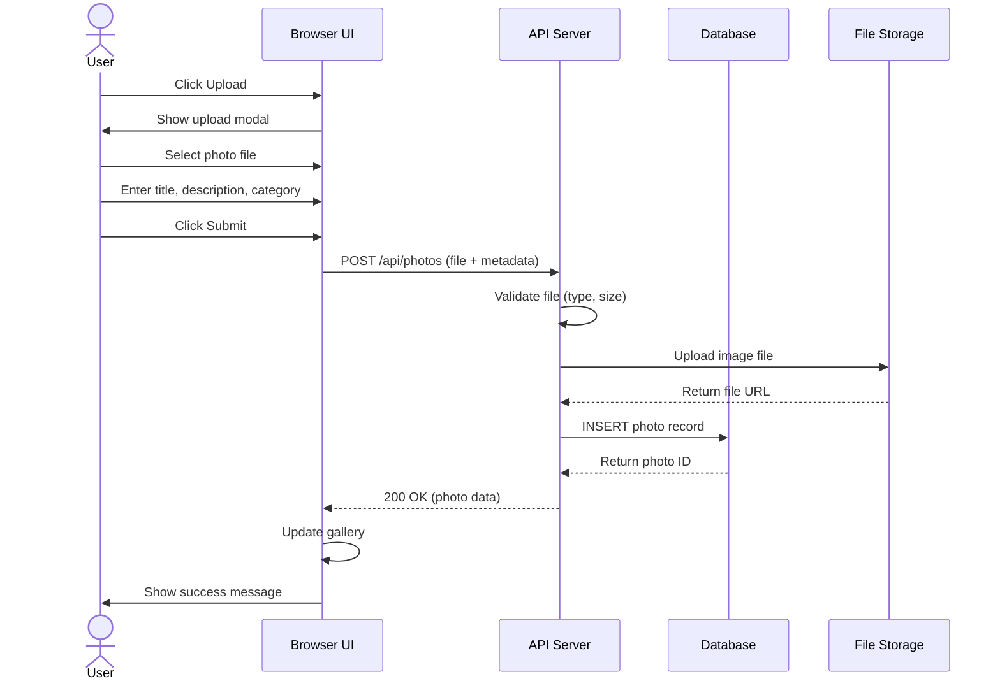
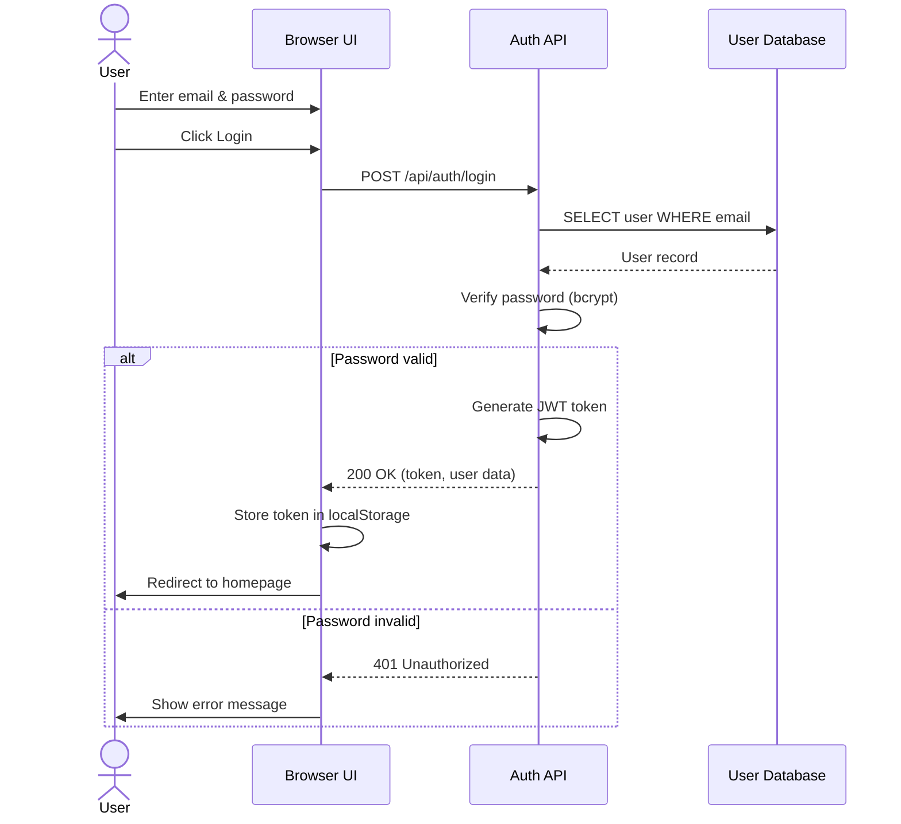
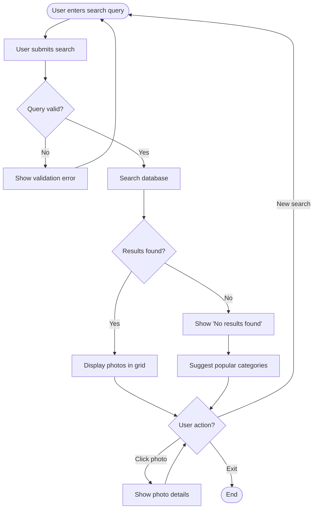
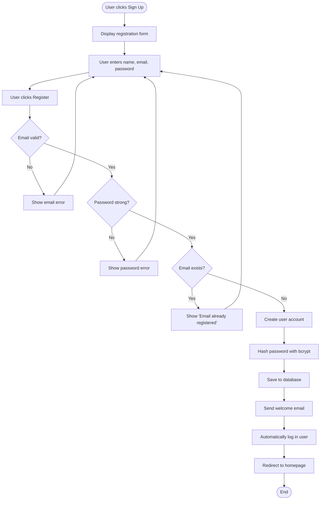
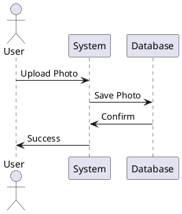

# Task #6: UML Diagrams

This folder contains UML diagrams for the Shutterly photography platform.

## Diagram Types

### 1. Use Case Diagram
**File:** `use-case-diagram.png` or create at [draw.io](https://app.diagrams.net/)

**Description:** Shows actors (users) and their interactions with the system.

**Actors:**
- Guest User
- Registered User
- Photographer
- Administrator

**Use Cases:**
- Browse Photos
- Search Photos
- Filter by Category
- View Photo Details
- Register Account
- Login
- Upload Photo
- Save to Collection
- Like Photo
- Manage Profile
- Edit Profile
- Download Photo

---

### 2. Sequence Diagram - Photo Upload
**File:** `sequence-photo-upload.png`

**Description:** Shows the interaction sequence when a user uploads a photo.

**Participants:**
- User
- UI (Browser)
- API Server
- Database
- Storage Service

**Flow:**
1. User clicks "Upload" button
2. UI displays upload modal
3. User selects file
4. UI sends file to API
5. API validates file
6. API stores file in Storage
7. API saves metadata to Database
8. Database confirms save
9. API returns success
10. UI updates gallery

**Mermaid Code:**


---

### 3. Sequence Diagram - User Authentication
**File:** `sequence-user-login.png`

**Flow:**
1. User enters credentials
2. UI sends to API
3. API validates with Database
4. API generates session token
5. UI stores token
6. User is logged in

**Mermaid Code:**


---

### 4. Activity Diagram - Photo Search Process
**File:** `activity-photo-search.png`

**Description:** Shows the workflow when a user searches for photos.

**Mermaid Code:**


---

### 5. Activity Diagram - User Registration
**File:** `activity-user-registration.png`

**Mermaid Code:**


---

### 6. Class Diagram (see Task #8)
Detailed class structure is documented in Task-08-Class-ER-Diagrams.md

---

## How to Create These Diagrams

### Option 1: draw.io (Recommended)
1. Go to [app.diagrams.net](https://app.diagrams.net/)
2. Choose "Create New Diagram"
3. Select UML diagram type
4. Use the templates and tools to create diagrams
5. Export as PNG or SVG
6. Save to `docs/` folder

### Option 2: Lucidchart
1. Go to [lucid.app](https://lucid.app/)
2. Create account (free tier available)
3. Choose UML diagram template
4. Build your diagram
5. Export and save

### Option 3: PlantUML (Code-based)
1. Install PlantUML
2. Write diagram as code
3. Generate image
4. Example:


### Option 4: Mermaid (Embedded in Markdown)
- Already provided above in mermaid code blocks
- Can be rendered in GitHub, VS Code, or [mermaid.live](https://mermaid.live/)

---

## Checklist for Task #6

- [ ] Create Use Case Diagram
- [ ] Create Sequence Diagram - Photo Upload
- [ ] Create Sequence Diagram - User Authentication  
- [ ] Create Activity Diagram - Photo Search
- [ ] Create Activity Diagram - User Registration
- [ ] Export all diagrams to `docs/` folder
- [ ] Upload to GitHub repository
- [ ] Share repository link

---

## GitHub Repository Setup

```bash
# Initialize git repository (if not done)
git init

# Add all files
git add .

# Commit
git commit -m "Add UML diagrams for Shutterly project"

# Add remote (replace with your GitHub repo URL)
git remote add origin https://github.com/yourusername/shutterly.git

# Push to GitHub
git push -u origin main
```

---

## Tools Used

- **draw.io / diagrams.net** - Free, web-based diagram tool
- **Lucidchart** - Professional diagramming tool
- **Mermaid** - Text-based diagram generation
- **PlantUML** - Code-based UML diagrams

---

## References

1. UML 2.5 Specification - OMG (Object Management Group)
2. Fowler, M. (2003). *UML Distilled: A Brief Guide to the Standard Object Modeling Language*. Addison-Wesley.
3. Booch, G., Rumbaugh, J., & Jacobson, I. (2005). *The Unified Modeling Language User Guide*. Addison-Wesley.
