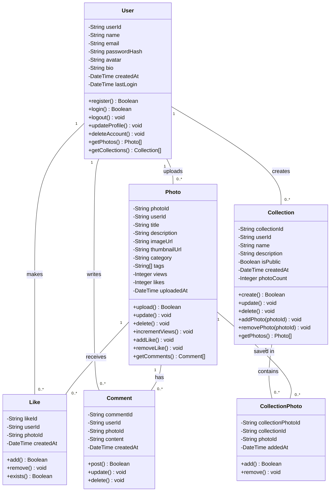
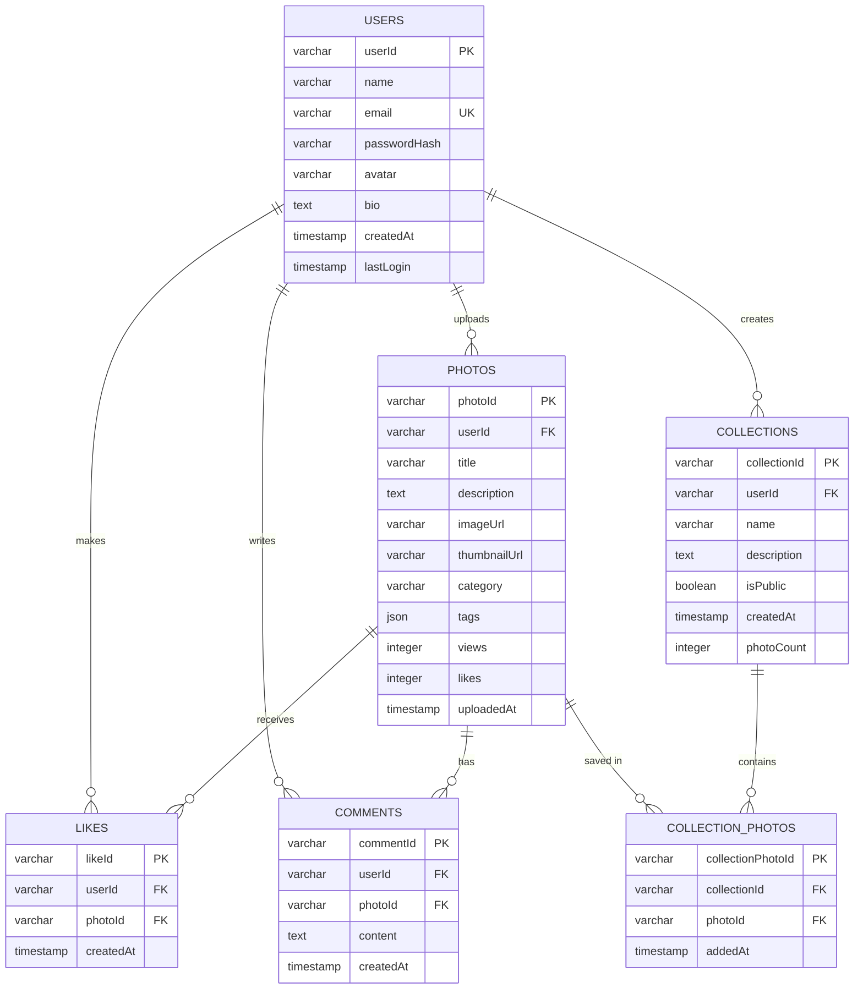

# Task #8: Class Diagrams and ER Diagrams

## Class Diagram

### Main Classes for Shutterly

#### 1. User Class
```
┌─────────────────────────────┐
│         User                │
├─────────────────────────────┤
│ - userId: String            │
│ - name: String              │
│ - email: String             │
│ - passwordHash: String      │
│ - avatar: String            │
│ - bio: String               │
│ - createdAt: DateTime       │
│ - lastLogin: DateTime       │
├─────────────────────────────┤
│ + register(): Boolean       │
│ + login(): Boolean          │
│ + logout(): void            │
│ + updateProfile(): void     │
│ + deleteAccount(): void     │
│ + getPhotos(): Photo[]      │
│ + getCollections(): Coll[]  │
└─────────────────────────────┘
```

#### 2. Photo Class
```
┌─────────────────────────────┐
│         Photo               │
├─────────────────────────────┤
│ - photoId: String           │
│ - userId: String            │
│ - title: String             │
│ - description: String       │
│ - imageUrl: String          │
│ - thumbnailUrl: String      │
│ - category: String          │
│ - tags: String[]            │
│ - views: Integer            │
│ - likes: Integer            │
│ - uploadedAt: DateTime      │
├─────────────────────────────┤
│ + upload(): Boolean         │
│ + update(): void            │
│ + delete(): void            │
│ + incrementViews(): void    │
│ + addLike(): void           │
│ + removeLike(): void        │
│ + getComments(): Comment[]  │
└─────────────────────────────┘
```

#### 3. Collection Class
```
┌─────────────────────────────┐
│       Collection            │
├─────────────────────────────┤
│ - collectionId: String      │
│ - userId: String            │
│ - name: String              │
│ - description: String       │
│ - isPublic: Boolean         │
│ - createdAt: DateTime       │
│ - photoCount: Integer       │
├─────────────────────────────┤
│ + create(): Boolean         │
│ + update(): void            │
│ + delete(): void            │
│ + addPhoto(photoId): void   │
│ + removePhoto(photoId): void│
│ + getPhotos(): Photo[]      │
└─────────────────────────────┘
```

#### 4. Like Class
```
┌─────────────────────────────┐
│          Like               │
├─────────────────────────────┤
│ - likeId: String            │
│ - userId: String            │
│ - photoId: String           │
│ - createdAt: DateTime       │
├─────────────────────────────┤
│ + add(): Boolean            │
│ + remove(): void            │
│ + exists(): Boolean         │
└─────────────────────────────┘
```

#### 5. Comment Class
```
┌─────────────────────────────┐
│        Comment              │
├─────────────────────────────┤
│ - commentId: String         │
│ - userId: String            │
│ - photoId: String           │
│ - content: String           │
│ - createdAt: DateTime       │
├─────────────────────────────┤
│ + post(): Boolean           │
│ + update(): void            │
│ + delete(): void            │
└─────────────────────────────┘
```

---

### Class Relationships

**Mermaid Class Diagram:**



---

## Entity-Relationship (ER) Diagram

### Database Schema

#### Tables:

**1. users**
- userId (PK, VARCHAR, UUID)
- name (VARCHAR)
- email (UNIQUE, VARCHAR)
- passwordHash (VARCHAR)
- avatar (VARCHAR, nullable)
- bio (TEXT, nullable)
- createdAt (TIMESTAMP)
- lastLogin (TIMESTAMP)

**2. photos**
- photoId (PK, VARCHAR, UUID)
- userId (FK → users.userId)
- title (VARCHAR)
- description (TEXT)
- imageUrl (VARCHAR)
- thumbnailUrl (VARCHAR)
- category (VARCHAR)
- tags (JSON or TEXT[])
- views (INTEGER, default 0)
- likes (INTEGER, default 0)
- uploadedAt (TIMESTAMP)

**3. collections**
- collectionId (PK, VARCHAR, UUID)
- userId (FK → users.userId)
- name (VARCHAR)
- description (TEXT, nullable)
- isPublic (BOOLEAN, default true)
- createdAt (TIMESTAMP)
- photoCount (INTEGER, default 0)

**4. collection_photos** (Junction table)
- collectionPhotoId (PK, VARCHAR, UUID)
- collectionId (FK → collections.collectionId)
- photoId (FK → photos.photoId)
- addedAt (TIMESTAMP)
- UNIQUE(collectionId, photoId)

**5. likes**
- likeId (PK, VARCHAR, UUID)
- userId (FK → users.userId)
- photoId (FK → photos.photoId)
- createdAt (TIMESTAMP)
- UNIQUE(userId, photoId)

**6. comments**
- commentId (PK, VARCHAR, UUID)
- userId (FK → users.userId)
- photoId (FK → photos.photoId)
- content (TEXT)
- createdAt (TIMESTAMP)

---

### ER Diagram (Mermaid)



---

### Visual ER Diagram (Chen Notation)

```
┌──────────┐           ┌──────────┐           ┌──────────┐
│  USERS   │───uploads─│  PHOTOS  │───saved_in│COLLECTION│
└──────────┘     1:N   └──────────┘     M:N   │  _PHOTOS │
     │                       │                 └──────────┘
     │ 1                     │ 1                    │
     │                       │                      │ N
     │ creates               │ receives             │
     │ 1:N                   │ 1:N                  │ 1
     │                       │                      │
     ▼                       ▼                 ┌────▼──────┐
┌──────────┐           ┌──────────┐           │COLLECTION │
│COLLECTION│           │  LIKES   │           └───────────┘
└──────────┘           └──────────┘
     │
     │ writes
     │ 1:N
     ▼
┌──────────┐
│ COMMENTS │
└──────────┘
```

---

## SQL Schema (MySQL Example)

```sql
-- Users table
CREATE TABLE users (
    userId VARCHAR(36) PRIMARY KEY,
    name VARCHAR(255) NOT NULL,
    email VARCHAR(255) UNIQUE NOT NULL,
    passwordHash VARCHAR(255) NOT NULL,
    avatar VARCHAR(500),
    bio TEXT,
    createdAt TIMESTAMP DEFAULT CURRENT_TIMESTAMP,
    lastLogin TIMESTAMP,
    INDEX idx_email (email)
);

-- Photos table
CREATE TABLE photos (
    photoId VARCHAR(36) PRIMARY KEY,
    userId VARCHAR(36) NOT NULL,
    title VARCHAR(255) NOT NULL,
    description TEXT,
    imageUrl VARCHAR(500) NOT NULL,
    thumbnailUrl VARCHAR(500),
    category VARCHAR(50),
    tags JSON,
    views INT DEFAULT 0,
    likes INT DEFAULT 0,
    uploadedAt TIMESTAMP DEFAULT CURRENT_TIMESTAMP,
    FOREIGN KEY (userId) REFERENCES users(userId) ON DELETE CASCADE,
    INDEX idx_user (userId),
    INDEX idx_category (category),
    INDEX idx_uploaded (uploadedAt)
);

-- Collections table
CREATE TABLE collections (
    collectionId VARCHAR(36) PRIMARY KEY,
    userId VARCHAR(36) NOT NULL,
    name VARCHAR(255) NOT NULL,
    description TEXT,
    isPublic BOOLEAN DEFAULT TRUE,
    createdAt TIMESTAMP DEFAULT CURRENT_TIMESTAMP,
    photoCount INT DEFAULT 0,
    FOREIGN KEY (userId) REFERENCES users(userId) ON DELETE CASCADE,
    INDEX idx_user (userId)
);

-- Collection_Photos junction table
CREATE TABLE collection_photos (
    collectionPhotoId VARCHAR(36) PRIMARY KEY,
    collectionId VARCHAR(36) NOT NULL,
    photoId VARCHAR(36) NOT NULL,
    addedAt TIMESTAMP DEFAULT CURRENT_TIMESTAMP,
    FOREIGN KEY (collectionId) REFERENCES collections(collectionId) ON DELETE CASCADE,
    FOREIGN KEY (photoId) REFERENCES photos(photoId) ON DELETE CASCADE,
    UNIQUE KEY unique_collection_photo (collectionId, photoId),
    INDEX idx_collection (collectionId),
    INDEX idx_photo (photoId)
);

-- Likes table
CREATE TABLE likes (
    likeId VARCHAR(36) PRIMARY KEY,
    userId VARCHAR(36) NOT NULL,
    photoId VARCHAR(36) NOT NULL,
    createdAt TIMESTAMP DEFAULT CURRENT_TIMESTAMP,
    FOREIGN KEY (userId) REFERENCES users(userId) ON DELETE CASCADE,
    FOREIGN KEY (photoId) REFERENCES photos(photoId) ON DELETE CASCADE,
    UNIQUE KEY unique_user_photo (userId, photoId),
    INDEX idx_user (userId),
    INDEX idx_photo (photoId)
);

-- Comments table
CREATE TABLE comments (
    commentId VARCHAR(36) PRIMARY KEY,
    userId VARCHAR(36) NOT NULL,
    photoId VARCHAR(36) NOT NULL,
    content TEXT NOT NULL,
    createdAt TIMESTAMP DEFAULT CURRENT_TIMESTAMP,
    FOREIGN KEY (userId) REFERENCES users(userId) ON DELETE CASCADE,
    FOREIGN KEY (photoId) REFERENCES photos(photoId) ON DELETE CASCADE,
    INDEX idx_photo (photoId),
    INDEX idx_user (userId)
);
```

---

## How to Create Visual Diagrams

### Using draw.io
1. Visit [app.diagrams.net](https://app.diagrams.net/)
2. Select "Entity Relationship" template
3. Add entities (tables) and define attributes
4. Add relationships with cardinality
5. Export as PNG/SVG

### Using MySQL Workbench
1. Open MySQL Workbench
2. Create a new EER Diagram
3. Add tables with columns
4. Define relationships and foreign keys
5. Export diagram image

### Using Lucidchart
1. Go to [lucid.app](https://lucid.app/)
2. Choose ER diagram template
3. Build schema visually
4. Export diagram

---

## Checklist for Task #8

- [ ] Create Class Diagram with all main classes
- [ ] Define class relationships
- [ ] Create ER Diagram showing all entities
- [ ] Define entity relationships and cardinality
- [ ] Export diagrams as PNG/SVG
- [ ] Save to `docs/` folder in GitHub
- [ ] Verify foreign keys and constraints
- [ ] Document in README

---

## References

1. Elmasri, R., & Navathe, S. B. (2015). *Fundamentals of Database Systems* (7th ed.). Pearson.
2. Chen, P. P. (1976). "The Entity-Relationship Model." *ACM Transactions on Database Systems*, 1(1), 9-36.
3. Fowler, M. (2003). *UML Distilled*. Addison-Wesley.
