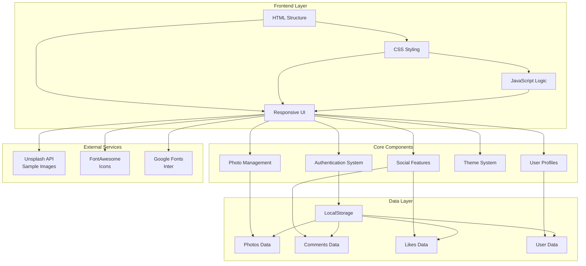
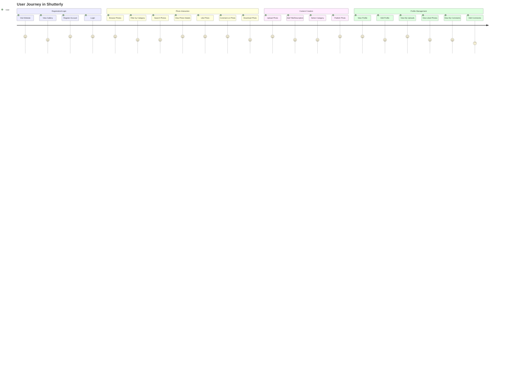
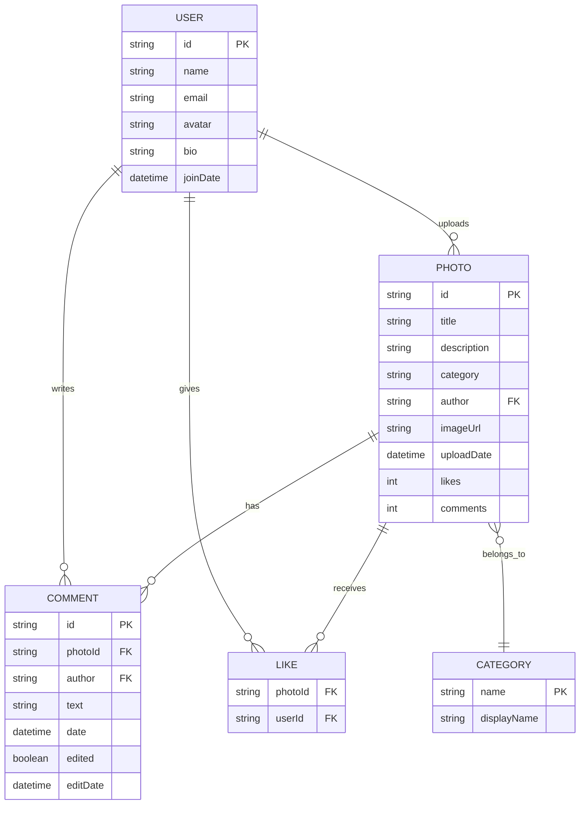
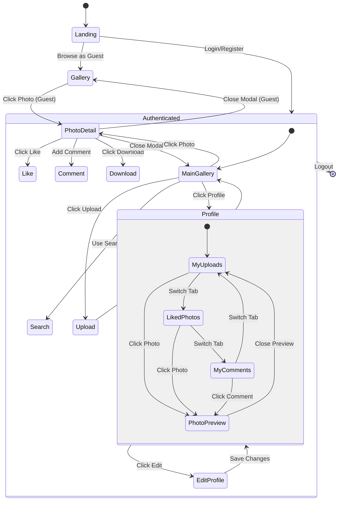
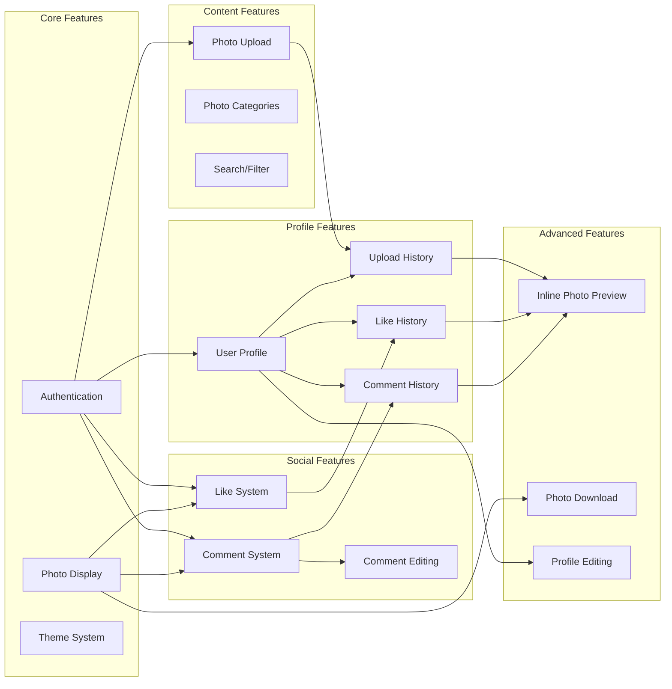
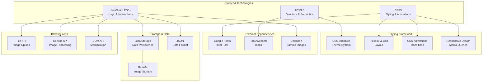
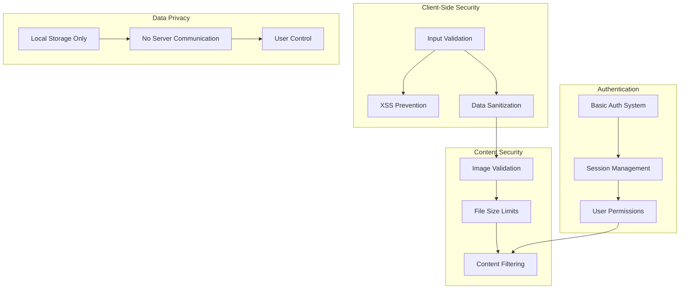

# Shutterly - Project Diagrams and Modeling

This document contains various diagrams modeling the Shutterly photo sharing platform architecture, user flows, and system components.

## 1. System Architecture Diagram

## 2. User Journey Flow

## 3. Data Model Structure

## 4. Component Architecture

```mermaid
graph TD
    subgraph "ShutterlyApp Class"
        A[Constructor] --> B[Initialize]
        B --> C[Setup Event Listeners]
        B --> D[Setup Theme]
        B --> E[Load User Session]
        B --> F[Load Sample Data]
        B --> G[Render Photos]
    end
    
    subgraph "Authentication Module"
        H[Login Handler]
        I[Register Handler]
        J[Logout Handler] 
        K[Update Auth UI]
    end
    
    subgraph "Photo Module"
        L[Photo Gallery]
        M[Photo Upload]
        N[Photo Detail Modal]
        O[Photo Search/Filter]
    end
    
    subgraph "Social Module"
        P[Like System]
        Q[Comment System]
        R[Comment Editing]
        S[Download Feature]
    end
    
    subgraph "Profile Module"
        T[User Profile Modal]
        U[Profile Tabs]
        V[My Uploads]
        W[Liked Photos]
        X[My Comments]
        Y[Edit Profile]
    end
    
    subgraph "Theme Module"
        Z[Theme Toggle]
        AA[Theme Storage]
        AB[CSS Variables]
    end
    
    A --> H
    A --> L
    A --> P
    A --> T
    A --> Z
    
    H --> K
    I --> K
    J --> K
    
    L --> M
    L --> N
    L --> O
    
    P --> Q
    Q --> R
    
    T --> U
    U --> V
    U --> W
    U --> X
    T --> Y
```

## 5. User Interface State Flow

## 6. Feature Dependencies

## 7. Technology Stack

## 8. Security & Privacy Model

## Summary

The Shutterly project is architected as a modern, client-side photo sharing platform with the following key characteristics:

### Architecture Highlights:
- **Single Page Application (SPA)** built with vanilla JavaScript
- **Component-based structure** with modular functionality
- **Local storage persistence** for offline capability
- **Responsive design** with mobile-first approach
- **Theme system** supporting dark/light modes

### Key Design Patterns:
- **MVC Pattern**: Clear separation of data, view, and logic
- **Observer Pattern**: Event-driven interactions
- **Strategy Pattern**: Pluggable theme system
- **Factory Pattern**: Dynamic content generation

### Technical Strengths:
- **No dependencies**: Pure HTML/CSS/JS implementation
- **Offline capable**: All data stored locally
- **Performance optimized**: Lightweight and fast
- **Accessibility focused**: Semantic HTML and proper ARIA
- **Mobile responsive**: Touch-friendly interactions

This modeling provides a comprehensive view of the Shutterly platform's architecture, user flows, and technical implementation for future development and maintenance.